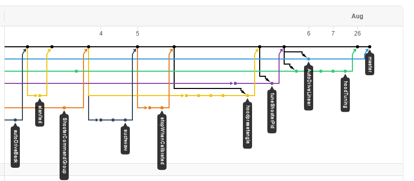
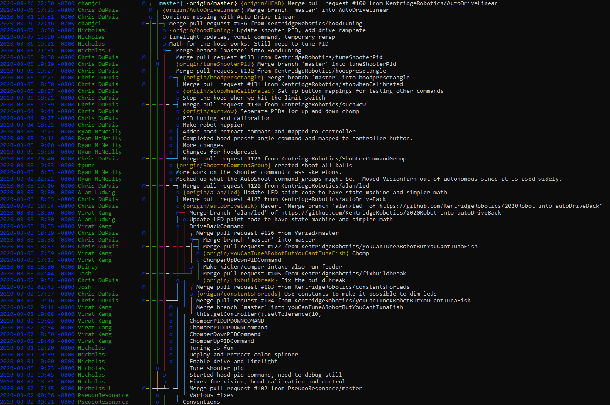
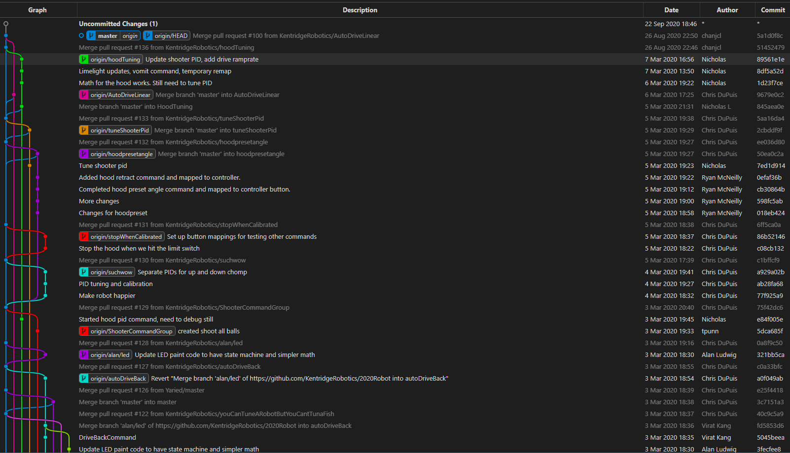

# Git Basics

## Creating a new Repository

Though repositories are typically created on the remote (GitHub/GitLab/etc.), you
can initialize a repository on your machine directly. To do so, first create a
new directory to contain the repository, then perform the following:

- [CommandLine](CommandLine/3-GitBasics.md#creating-a-new-repository)
- [VSCode](VSCode/3-GitBasics.md#creating-a-new-repository)
- [GitHub Desktop](GitHubDesktop/3-GitBasics.md#creating-a-new-repository)

## Cloning a Repository

Fetching an existing repository from a remote (GitHub/GitLab/etc.) is called
cloning and will vary somewhat depending on the remote.

You will first need to acquire the link to clone the repository from the remote.
This will take the form of either an HTTPS link or an SSH link. Below are some
examples of these:

HTTPS

```txt
https://gitlab.com/chargerrobotics3786/learning/LearningGit.git
```

SSH

```txt
git@gitlab.com:chargerrobotics3786/learning/LearningGit.git
```

See your remote's documentation on how to get this link.

Take this link and perform the following based upon your preferred Git tool:

- [CommandLine](CommandLine/3-GitBasics.md#cloning-a-repository)
- [VSCode](VSCode/3-GitBasics.md#cloning-a-repository)
- [GitHub Desktop](GitHubDesktop/3-GitBasics.md#cloning-a-repository)

## Making a commit

Creating a commit consists of a adding untracked or unstaged files to the staging
area, then committing those changes with a commit message describing what it is
that has changed.

Here's how to do this:

- [CommandLine](CommandLine/3-GitBasics.md#making-a-commit)
- [VSCode](VSCode/3-GitBasics.md#making-a-commit)
- [GitHub Desktop](GitHubDesktop/3-GitBasics.md#making-a-commit)

## Commit Messages

- [CommandLine](CommandLine/3-GitBasics.md#commit-messages)
- [VSCode](VSCode/3-GitBasics.md#commit-messages)
- [GitHub Desktop](GitHubDesktop/3-GitBasics.md#commit-messages)

## The Commit Graph

We've discussed what the commit graph is [previously](1-WhatIsGit.md), however,
it can be beneficial to have a visual idea of what is going on.

Below are a few different visualizations, from some different tools, of the commit
graph of a single repository.

### GitHub: Insights > Network



### Tig



### VSCode



### GitHub Desktop

GitHub Desktop currently does not implement this feature.

See the [relevant issue](https://github.com/desktop/desktop/issues/1634).
