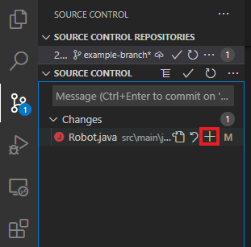
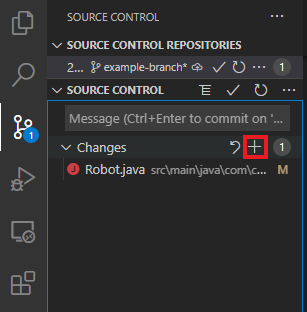
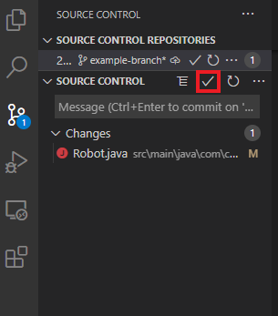

# Making your First Commit

1. Make a new file named `FirstCommit.txt`
2. Add `Hello World!` to `FirstCommit.txt`
3. Commit it

---------

## ***Hints***

    
Hint 1

    <blockquote>
    

        
Command Line

To add a file to the staging area, use `git add [<filename>...]`
    

    

        
VSCode

You can add files to the staging area using the `Stage Changes` or
`Stage All Changes` buttons.

    

    

        
GitHub Desktop

To make a commit, fill in the details and click the `Commit to <branch>` button:

   

   </blockquote>

    
Hint 2

    <blockquote>
    

        
Command Line

To make a commit, use `git commit`

**Extra hint:** The `-m [message]` flag can be used to add the commit
message within the `commit` command!
    

    

        
VSCode

To make a commit, click the `Commit` button:

    

    </blockquote>

