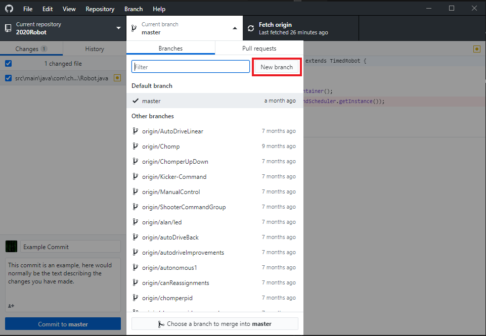
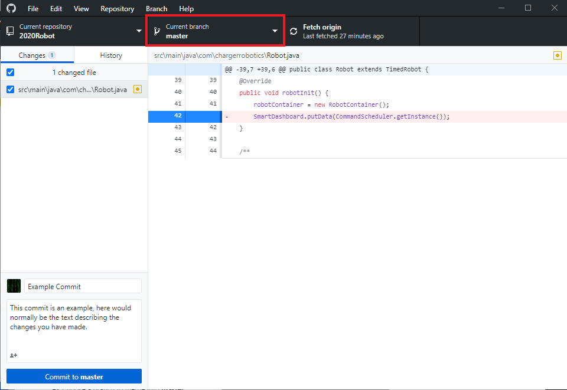

# Creating A Branch

1. Create a new branch named `first-branch`
2. Switch over to your new branch

---------

## ***Hints***

    
Hint 1

    <blockquote>
    

        
Command Line

Branches are created using `git branch [branch name]`
    

    

        
VSCode

You can create a branch using the `Create Branch...` button in the
`More Actions...` menu:

    

    

        
GitHub Desktop

Branches are created using the branch dropdown's `New branch`:

   

   </blockquote>

    
Hint 2

    <blockquote>
    

        
Command Line

Branches can be checked out with `git checkout [branch name]`

**Extra Hint:** Branches can be created and checked out at once with
`git checkout -b [branch name]`
    

    

        
VSCode

You can switch branches using the `Checkout to...` button:

    

    

        
GitHub Desktop

To checkout a branch, use the branch dropdown:

    

    </blockquote>

