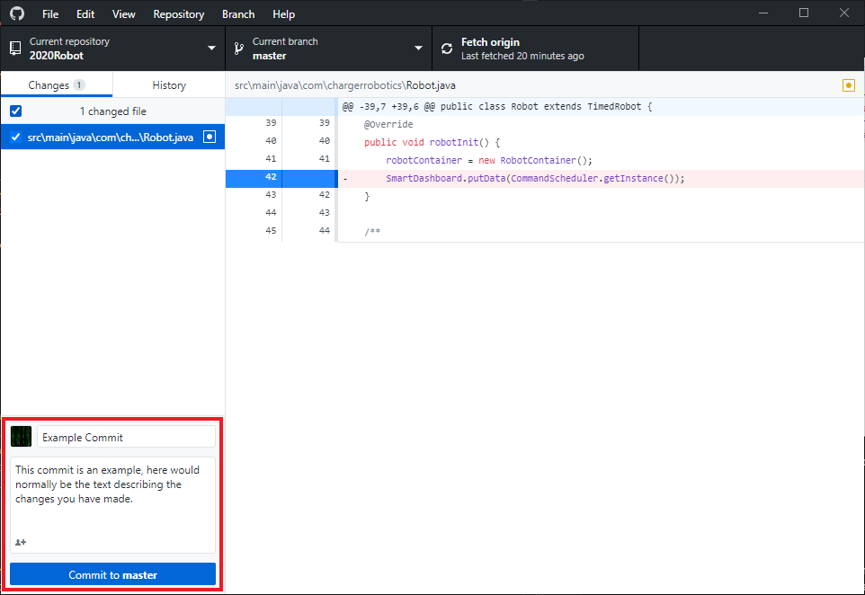

# Git Basics

## Creating a new Repository

To create a new local repository, navigate to `File > New repository...` (or use
the keyboard shortcut of `Ctrl-N`) and follow the wizard to complete this process.

## Cloning a Repository

To clone a repository from a remote, navigate to `File > Clone repository...`, select the URL tab and provide the link retrieved from the remote repository.

**Note:** For any remote repositories not on github.com, you will likely need to
use the HTTPS clone link rather than the SSH link.

## Making a commit

To make a commit, make any changes that you want to include in this commit, fill
in the commit title, then click the `Commit to <branch>` button.

## Commit Messages

You may have noticed in the [previous section](#making-a-commit) that there's a
section for a `Description`. This is the space to add your commit message to
help other developers understand what it is you've changed.
