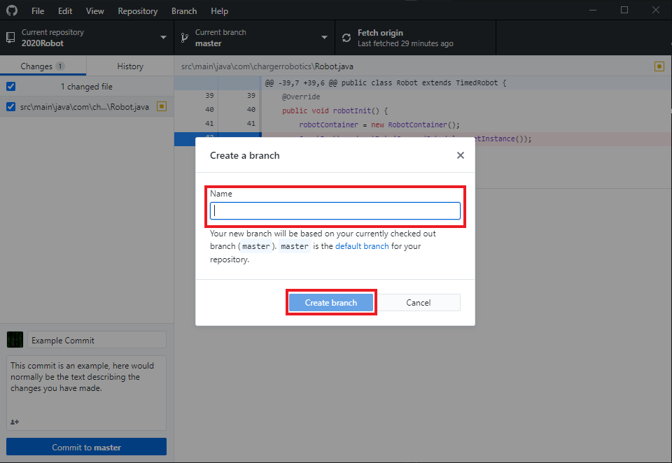

# Branches

## Creating a branch

To create a branch, first open up the branch dropdown:

Now click the `New Branch` button:

Finally, give your new branch a name and click `Create Branch`:

From the branch dropdown, you can also checkout any other branch in your
repository.
