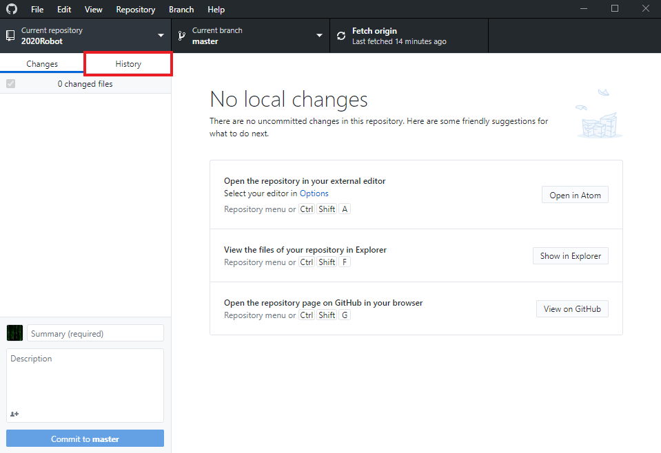
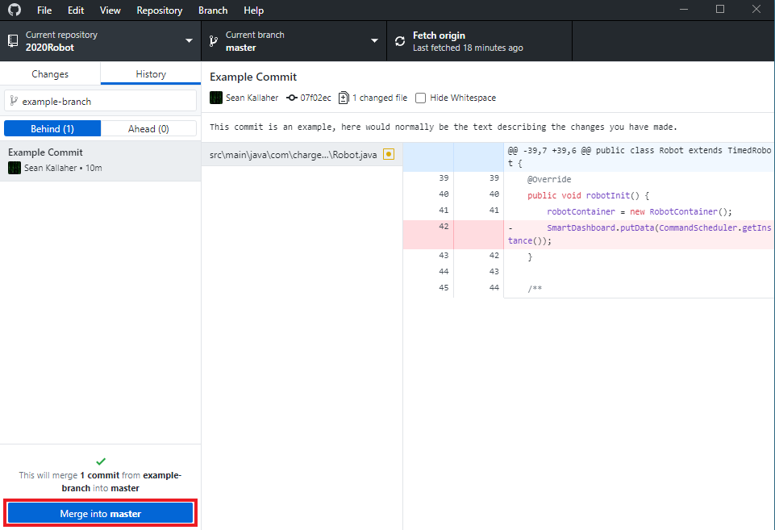
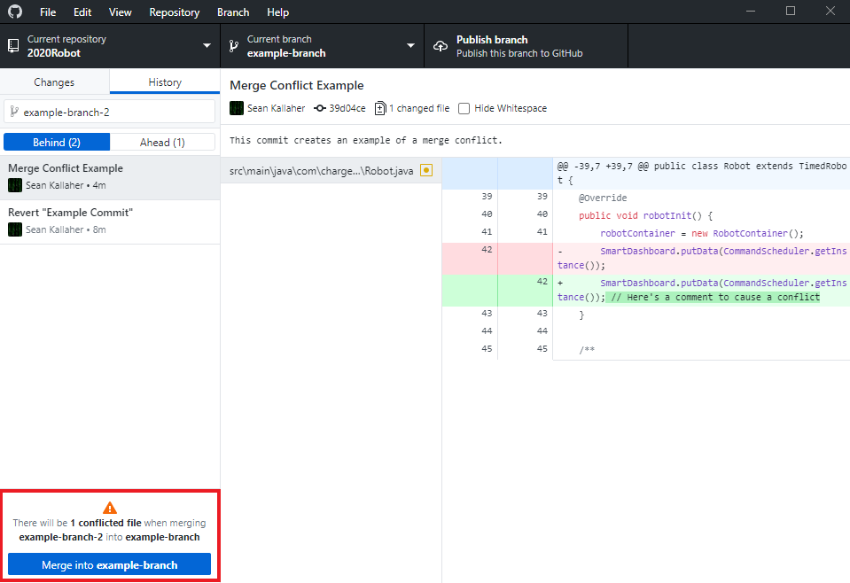
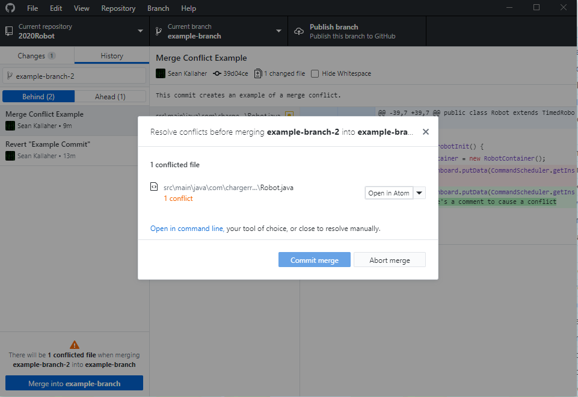
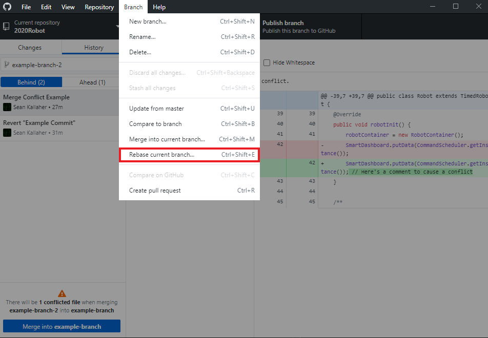
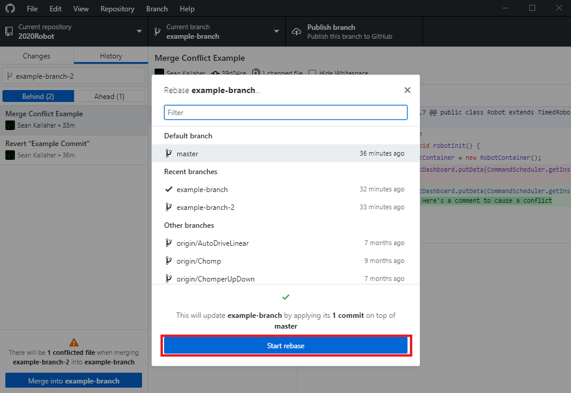

# Merging

## Merging two or more branches

To merge one branch into another, checkout the branch that you want to merge to
(See [Branches](4-Branches.md) on how to do this), then switch to the `history`
view:

Now, choose the branch that you want to merge into this one:

Finally, after verifying that all of the changes are what you want to merge,
click the `Merge into <branch>` button:

## Merge Conflicts

When a merge conflict occurs, GitHub Desktop will tell you that they are present:

When this happens, if you click the `Merge into <branch>` button, you will see
something like this dialog pop up:

At this point, you will need to open up your editor of choice to resolve the
conflict. Once you have, you can merge as normal.

## Rebasing

To rebase one branch onto another, open the `Branch` dropdown and select
`Rebase current branch...`:

From here, select the branch you want to rebase onto and click the `Start rebase`
button:

