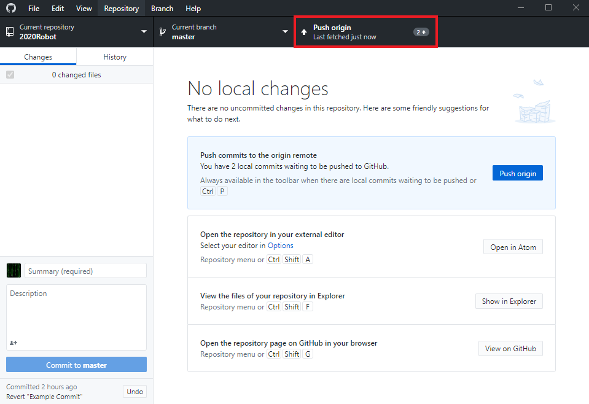
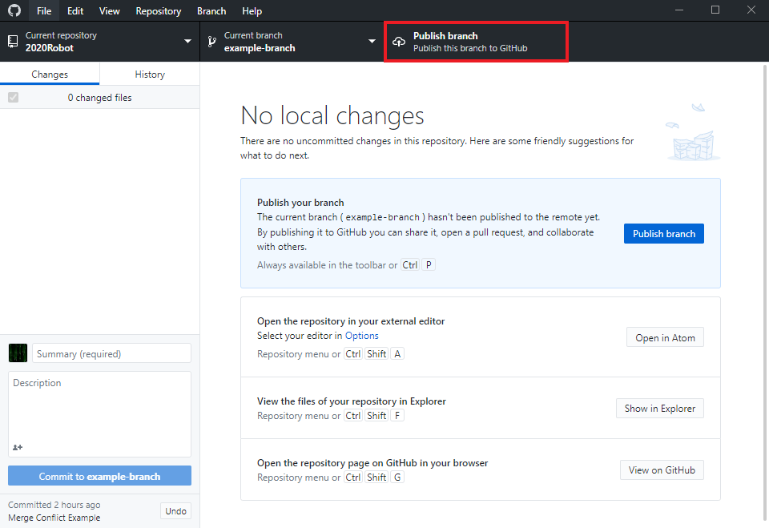

# Remotes

## Fetching

To run a fetch, use the `Fetch <remote>` button:

## Pulling

To pull changes, utilize the `Pull <remote>` button:
<!-- TODO: Add visual for this -->

## Pushing

To push your changes up to the remote, use the `Push <remote>` button:

You may also see the `Publish branch` button here. This just means that your
branch isn't on the remote yet.

