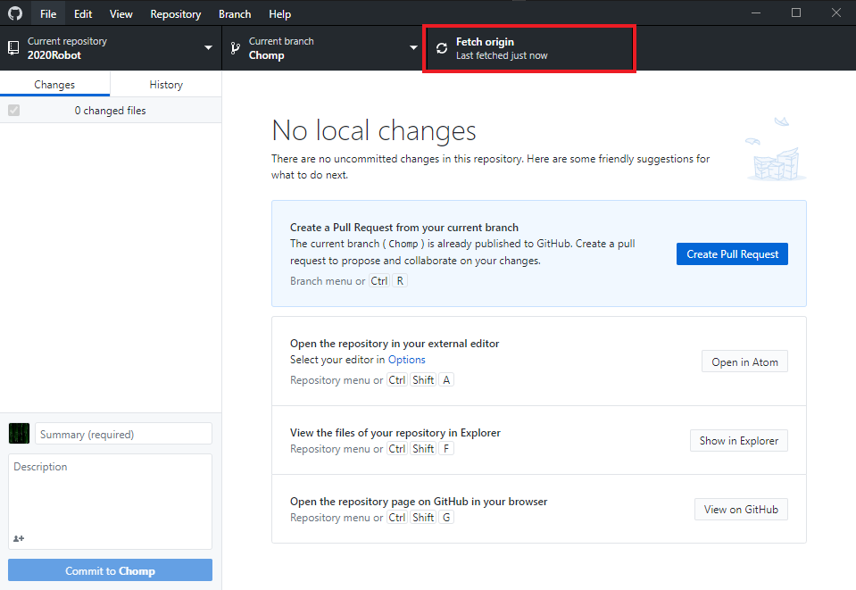

# Remotes

## Fetching

<!--TODO: Convert to GitHub Desktop instructions-->
To run a fetch, use the `Fetch <remote>` button:



## Pulling

<!--TODO: Convert to GitHub Desktop instructions-->
To pull changes, utilize one of the following forms of the `pull` command:

```bash
git pull
git pull <remote name> <branch name>
```

The former command will pull the upstream, the branch on the remote that your
local branch is linked to, of your branch into the local checked out version.

The latter command will pull the given branch from the given remote into the local
checked out branch.

## Pushing

<!--TODO: Convert to GitHub Desktop instructions-->
To push your changes up to the remote, use one of the forms of the `push` command:

```bash
git push
git push <remote name> <branch name>
```

The former command will either, depending on your configuration, push just the
branch you are currently on to its upstream (the branch it is linked to on the
remote), or push every branch to their upstreams.

The latter command will push the branch you are on to the given branch on the
given remote.
