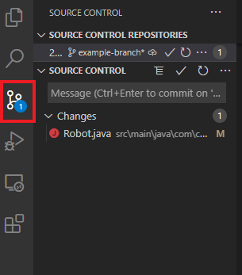
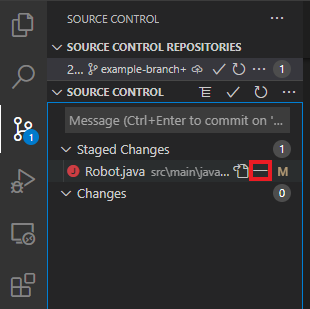
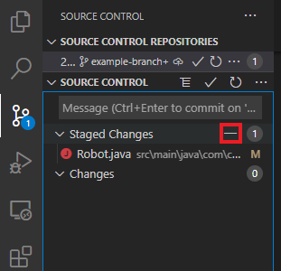

# Git Basics

## Creating a new Repository

VS Code does not currently support this operation. It is recommended to use the
one of the other tools to complete this task.

## Cloning a Repository

To clone a repository, navigate to the `Source Control` tab.

Open the `More Actions...` menu:

Choose `Clone` and input the URL retrieved from the remote repository.

## Making a commit

To make a commit, first you will need to add all of the files that you want to
be part of the commit to the staging area. To see the current state of your
repository, navigate to the `Source Control` tab:

This will show you which files have been changed or added, and in what part of the
staging process they are in.

To add a single file to the staging area, use the `Stage Changes` button for that
file:

Alternatively, you can add **all** files to the staging area using the
`Stage All Changes` button:

Once you've added all of the files you want to commit to the staging area,
click the `Commit` button, and provide a commit message:

If, at any time, you want to remove files from the commit you are about to make,
you can unstage them, using either the `Unstage Changes` button:

Or the `Unstage All Changes` button:

## Commit Messages

VSCode requires you to write a commit message when you click the `Commit` button.
