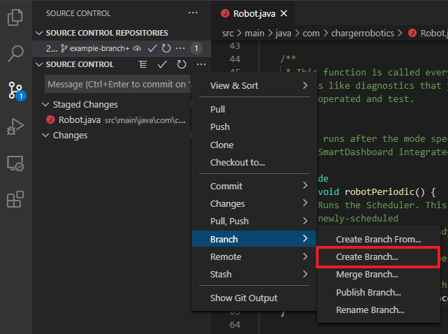
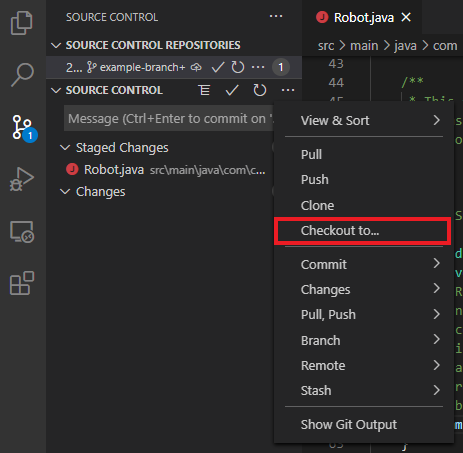

# Branches

## Creating a branch

To create a branch, open the `More Actions` menu:

Then in the `Branch` submenu:

Select the `Create Branch...` option and provide a branch name:

You can then switch over to, or checkout, that branch using the `Checkout to...`
button in the `More Actions` menu:

Then select the branch that you want to check out.
