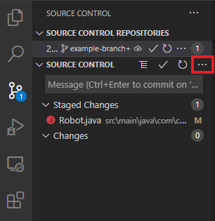
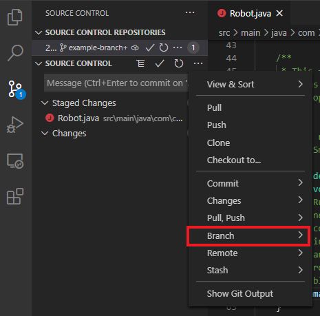
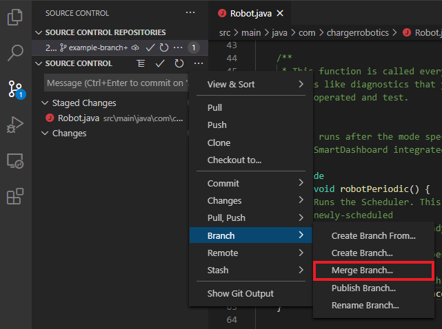
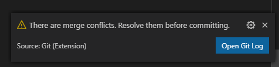
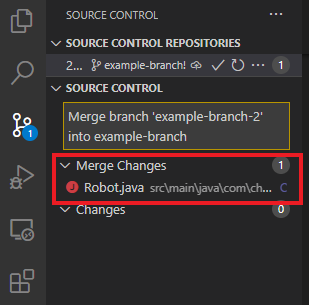
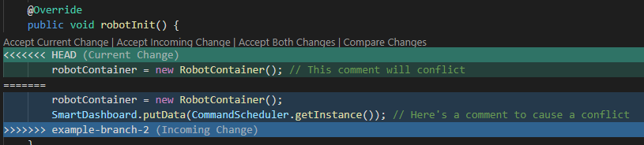

# Merging

## Merging two or more branches

To merge one branch into another, open the `More Actions...` menu:

Then select the `Branch` submenu:

Choose `Merge Branch...` and select the branch to merge into the one you currently
have checked out.

## Merge Conflicts

In the event of a merge conflict, VSCode will inform you that the conflict has
occurred with a notification and will show which files have conflicts.

Within the files that have conflicts, Git will add annotations to indicate which
lines are conflicting, which VSCode will render something like this:

These annotations should be removed when you resolve the merge conflict. Once you
have resolved the conflicts, you will need to stage all of the conflicted files
and then complete the merge by clicking the `Commit` button.

Somewhat frustratingly, VSCode does not natively support aborting a merge.

## Rebasing

VSCode does not natively support rebasing.
