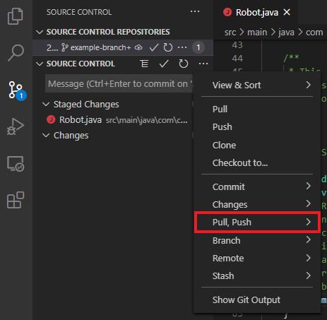
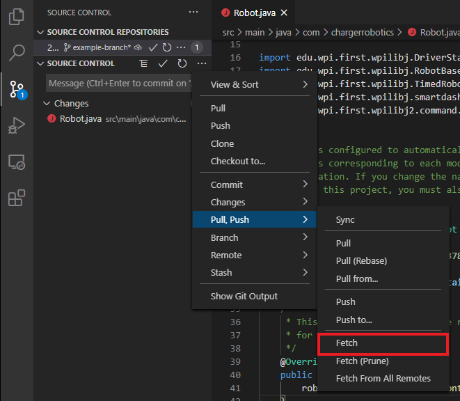
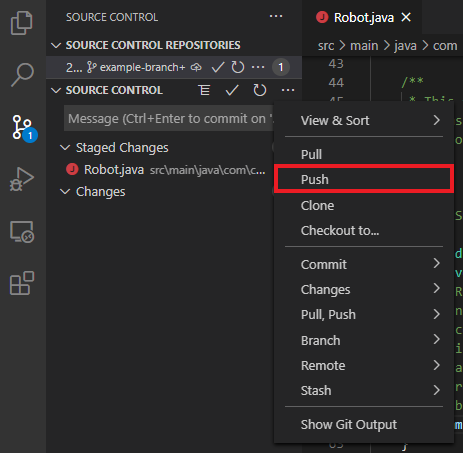

# Remotes

## Fetching

To run a fetch, open the `More Actions...` menu:

Then, under `Pull/Push`, use the `Fetch` button:

## Pulling

To pull changes, within the `More Actions...` menu, use the `Pull` button:

## Pushing

To push your changes up to the remote, use the `Push` button in `More Actions...`:

